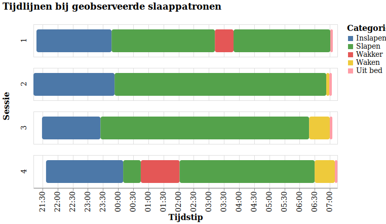

# Sleep analysis

Tool for analyzing sleeping patterns. Check it out [here](https://lcvriend.github.io/sleepanalysis/) (currently only available in Dutch).

## How to use?
Over one or more sessions observe sleeping patterns using the following statusses:
- Inslapen / Fall asleep (mandatory)
- Slapen / Sleep
- Wakker / Awake
- Waken / Wake
- Uit bed / Out of bed (mandatory)

Store data in ";" separated csv with the following columns:
1. Sessie / Session
2. Datum / Date (YYYYMMDD)
3. Tijd / Time (HH:MM:SS)
4. Status

Load the data.

## Example result

### Developers
L.P.H. Vriend & L.C. Vriend
